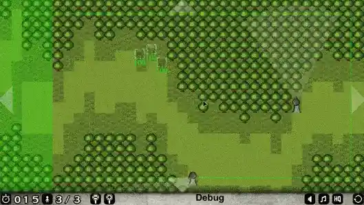

# Project 2030

> 🌐 [https://project2030.gargani.dev/](https://project2030.gargani.dev/)

## 🇧🇷 pt-br

### Controles/Controls

> ⚠️ Quando foi desenvolvido, o jogo havia sido otimizado para `mobile`, apesar disso, por ser um software antigo, é provável que ocorram vários bugs de UI, nesses aparelhos.

No teclado:

**[ Mouse / Mouse Click ]** - Nas bordas: Movimentar câmera; Nas unidades: Selecionar _(Clicar e arrastar)_; Interação com os menus.

**[ A/W/S/D ]** - Após selecionadas as unidades: Movimentar o conjunto.

**[ ESPAÇO ]** - Disparar com as unidades selecionadas em direção ao ponteiro do mouse.

**[ CTRL ]** - Ativa um modo de câmera relativo entre as unidades e o ponteiro do mouse (Bom para um jogo rápido).

### Regras

- Você começa com um número limitado de unidades. 
- As unidades (A ideia é que seriam mais de um tipo de unidade) tem um efeito especial. 
- No caso das tropas, elas são capazes de se esconder das torres ao ficar paradas no terreno com mato alto.
- Elas também são capazes de disparar ao mesmo tempo quando selecionadas, o que pode causar dano para uma torre.
- Se a torre conseguir te observar ou tomar dano, irá rotacionar em sua direção e disparar contra você.

### Sobre

"Project 2030" foi um projeto amador utilizando o [`Construct 2`](https://www.construct.net/en/construct-2/download) _(Descontinuado)_ desenvolvido para uma _Game Jam_ da _Newgrounds_ em torno de 2015.

O conceito gira em torno de subverter a mecânica tradicional de um Tower-defense, utilizando alguns elementos de _RTS_ para controlar as unidades, ao invés das torres. O objetivo é chegar ao final do mapa (gerado proceduralmente a cada nova rodada) com o maior número de unidades possível, no menor tempo possível.

> O código-fonte está em `/src`, porém o arquivo `/src/Project 2030.caproj` não pode ser aberto no _Construct 3_. Por tanto, também há um arquivo `/src/single_file_project.capx`, que pode funcionar nas versões mais novas do _Construct_ (Não testado). 

---

## 🇺🇸 en-us

### Controls

> ⚠️ When it was developed, the game had been optimized for `mobile`, despite this, as it is old software, it is likely that several UI bugs will occur on these devices.

On the keyboard:

**[ Mouse / Mouse Click ]** - On the edges: Move camera; In units: Select _(Click and drag)_; Interaction with the menus.

**[ A/W/S/D ]** - After selecting the units: Move the set.

**[ SPACE ]** - Shoot the selected units towards the mouse pointer.

**[ CTRL ]** - Activates a relative camera mode between the units and the mouse pointer (Good for quick gameplay).

### Rules

- You start with a limited number of units.
- The units (the idea is that there would be more than one type of unit) have a special effect.
- In the case of troops, they are able to hide from the towers by standing still in the terrain with tall grass.
- They are also able to fire at the same time when selected, which can cause damage to a tower.
- If the tower manages to observe you or take damage, it will rotate towards you and fire at you.

### About

"Project 2030" was an amateur project using [`Construct 2`](https://www.construct.net/en/construct-2/download) _(Discontinued)_ developed for the _Newgrounds Game Jam_ around 2015.

The concept revolves around subverting the traditional Tower-defense mechanics, using some _RTS_ elements to control units, instead of towers. The objective is to reach the end of the map (procedurally generated with each new round) with as many units as possible, in the shortest time possible.

> The source code is in `/src`, but the file `/src/Project 2030.caproj` cannot be opened in _Construct 3_. Therefore, there is also a file `/src/single_file_project.capx`, which may work on newer versions of _Construct_ (Not tested).